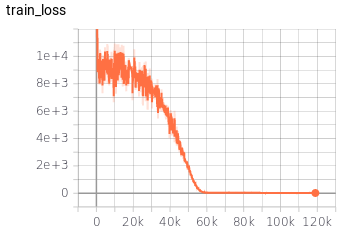
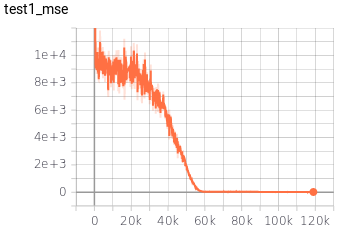

# Date2Vec

## About

This Repository contains several pretrained models and scripts to train new models to get embeddings of Time-Date data.
Autoencoder Model's layers are based on Cosine Activation function from "Time2Vec" paper.

## Usage

### Embeddings from pretrained model

Import Date2VecConvert Class from Model.py and use the object's `__call__` method to get embedding.

#### Example

```python
from Model import Date2VecConvert
import torch

# Date2Vec embedder object
# Loads a pretrained model
d2v = Date2VecConvert(model_path="./d2v_model/d2v_98291_17.169918439404636.pth")

# Date-Time is 13:23:30 2019-7-23
x = torch.Tensor([[13, 23, 30, 2019, 7, 23]]).float()

# Get embeddings
embed = d2v(x)

print(embed, embed.shape)
```
Output:
```python
tensor([  1.5502,  -3.2361,  -1.6112,  -5.6936,  -1.5411,  -2.2469,  -2.9789,
          2.2282,   1.3976,  -0.7998,  -0.5832,   0.8173,   7.9928,  -1.7402,
         -0.4342,   2.2130, -10.9533,   1.2677,   0.0374,   0.0504,  -1.1214,
         -1.0377,   1.3404,  -5.4184,  -0.1232,  -2.2410,  -3.4778,   1.8836,
          0.0324,   0.4323,  -1.0348,   6.7379,   0.0173,   0.9126,   0.1675,
          0.2571,  -0.9084,  -0.3421,  -0.9645,  -0.9206,  -0.1205,   0.6614,
          0.7904,  -0.6719,   0.6717,  -0.0115,  -0.4214,  -0.6423,   0.9074,
         -0.5311,   0.7155,   0.9098,  -0.6888,   0.8095,  -0.2459,   0.9649,
          0.4060,   0.9995,   0.6519,   0.9981,  -0.0737,  -0.1282,   0.1721,
         -0.8690]) torch.Size([64])
```

### Training custom models

* Experiment.py contains scripts for training, evaluating models tracking metrics using Tensorboard logs.
* Two different Experiment setups are available:
    1. Next Date prediction.
    2. Same Date prediction (reconstruction).

#### Example

```python
from Model import Date2Vec
from Data import NextDateDataset, TimeDateDataset
import torch
from torch.utils.data import DataLoader
from sklearn.metrics import mean_absolute_error, mean_squared_error
from tensorboard_logger import configure, log_value
import os

act = 'cos'
optim = 'adam'
os.system("mkdir ./models/d2v_{}".format(act))
configure("logs/d2v_{}".format(act))

m = Date2Vec(k=64, act=act)
#m = torch.load("models/sin/nextdate_11147_23.02417500813802.pth")
exp = Date2VecExperiment(m, act, lr=0.001, cuda=True, optim=optim)
exp.train()
```

##### Training Statistics:

1. Training Loss (MSE v/s Batches)



2. Validation Loss, first set (MSE v/s Validation Steps)



3. Validation Loss, second set (MSE v/s Validation Steps)


## TODO

1. Models for only Time and only Date.

## Authors

***Surya Kant Sahu** - [ojus1](https://github.com/ojus1)

## License

This project is licensed under the MIT License - [LICENSE.md](./LICENSE.md)

## Acknowledgments

* Packages used for Machine learning model: Python: Pandas, PyTorch
* Paper Title: "Time2Vec: Learning a Vector Representation of Time" - https://arxiv.org/pdf/1907.05321.pdf